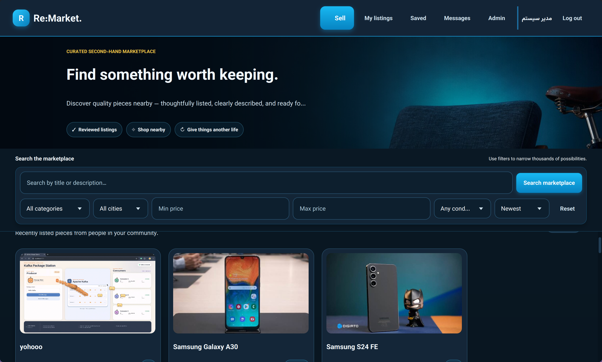
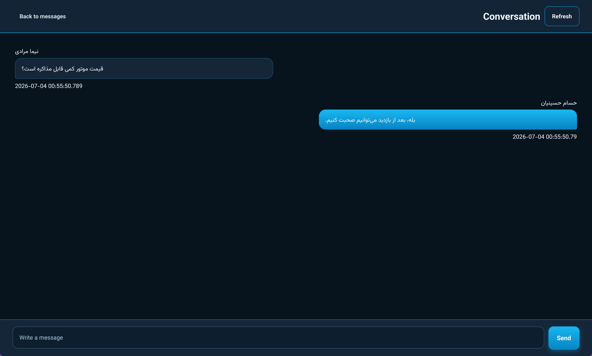
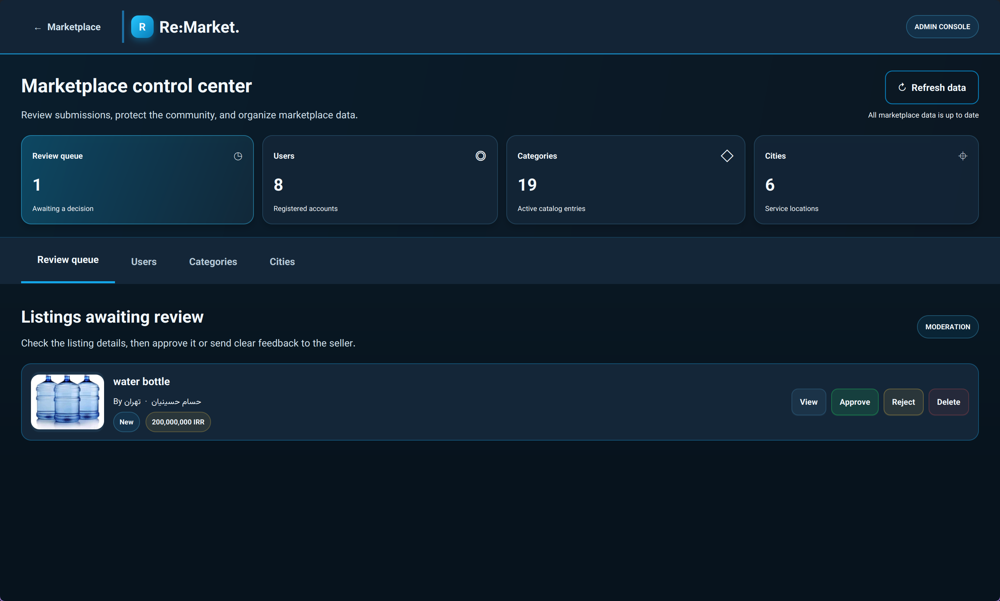
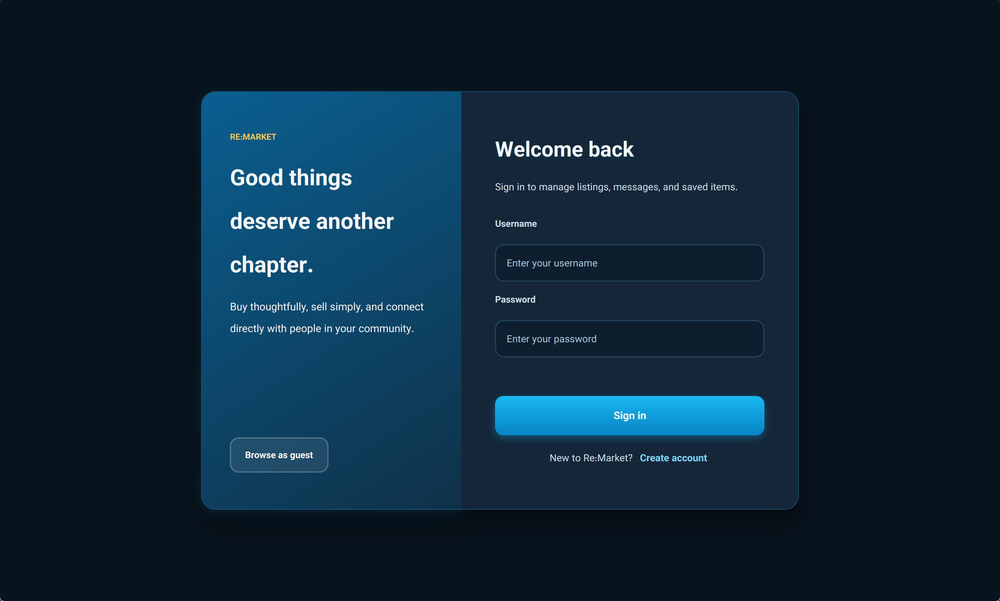

# Secondhand Marketplace

A complete desktop second-hand marketplace built with Java, Spring Boot, JavaFX, and SQLite. The application follows a real client-server architecture: JavaFX communicates with the backend through JSON REST APIs, and only the backend accesses the database.

> **Educational demo:** This repository is an Advanced Programming course project prepared as a runnable reference/demo for AP students at Amirkabir University of Technology. It is not an official university product or a production marketplace.

## Screenshots

### Marketplace



### Conversations



### Admin panel



### Login



## Main features

### User features

- Register and sign in with JWT authentication
- Browse active advertisements
- Search and filter by keyword, category, city, price, and condition
- Sort advertisements by newest, cheapest, or most expensive
- View product images and seller ratings
- Create and edit advertisements
- Upload product images from the computer
- Track pending, active, rejected, sold, and deleted advertisements
- Save and remove favorites
- Start a conversation with a seller
- Send and refresh stored chat messages
- Rate sellers after an existing conversation

### Admin features

- Review pending advertisements
- Approve, reject, or soft-delete advertisements
- Store rejection reasons
- View all users
- Block and unblock users
- Prevent an admin from blocking their own account
- Create and disable hierarchical categories
- Create and disable cities

## Technology stack

### Backend

- Java 17+
- Spring Boot 3.3
- Spring Web
- Spring Data JPA
- Spring Security
- Bean Validation
- JWT authentication
- SQLite JDBC
- Hibernate community SQLite dialect
- Maven

### Frontend

- JavaFX 21
- FXML
- CSS
- Java `HttpClient`
- Jackson
- Maven JavaFX plugin

### Storage and deployment

- SQLite database
- Local image storage
- Multi-stage backend Dockerfile
- Docker Compose

## Architecture

```text
JavaFX desktop client
        |
        | HTTP + JSON + JWT
        v
Spring Boot REST backend
        |
        +---- SQLite database
        |
        +---- Local uploaded images
```

The frontend never connects directly to SQLite. Protected requests include:

```http
Authorization: Bearer <token>
```

The JWT is kept in frontend memory and cleared on logout or authentication failure.

## Repository structure

```text
.
├── backend/
│   ├── Dockerfile
│   ├── pom.xml
│   └── src/main/
│       ├── java/com/secondhand/
│       │   ├── config/
│       │   ├── controller/
│       │   ├── dto/
│       │   ├── entity/
│       │   ├── exception/
│       │   ├── repository/
│       │   ├── security/
│       │   ├── seed/
│       │   └── service/
│       └── resources/application.properties
├── frontend/
│   ├── pom.xml
│   └── src/main/
│       ├── java/com/secondhand/client/
│       │   ├── api/
│       │   ├── app/
│       │   ├── auth/
│       │   ├── controller/
│       │   ├── model/
│       │   └── util/
│       └── resources/
│           ├── fxml/
│           └── styles/app.css
├── data/
│   ├── secondhand.db
│   └── uploads/
├── docs/screenshots/
├── docker-compose.yml
└── README.md
```

Each main JavaFX screen has its own FXML document and controller. `NavigationManager` handles screen changes, while `app.css` contains the shared visual styling.

## Requirements

- JDK 17 or newer
- Maven 3.9 or newer
- Internet access only for the first Maven dependency download
- Docker and Docker Compose are optional

JavaFX must run on a desktop environment with a graphical display.

## Running locally

Open the first terminal and run the backend:

```bash
cd backend
mvn spring-boot:run
```

Wait for:

```text
Started BackendApplication
```

Then open another terminal and run the desktop client:

```bash
cd frontend
mvn javafx:run
```

If the backend is running at a different address, configure the client with:

```bash
SECONDHAND_API_URL=http://localhost:18080 mvn javafx:run
```

The backend listens on:

```text
http://localhost:8080
```

## Running the backend with Docker

From the repository root:

```bash
docker compose up --build
```

Run the JavaFX frontend locally in another terminal:

```bash
cd frontend
mvn javafx:run
```

The GUI is intentionally not placed inside Docker.

## Database and images

Both local and Docker runs use the project `data` directory:

```text
data/secondhand.db
data/uploads/
```

- SQLite creates its tables automatically.
- Uploaded images are stored in `data/uploads`.
- Seed images are also stored locally in `data/uploads`.
- SQLite stores image HTTP URLs rather than binary image data.
- Docker mounts `./data` at `/app/data`, so data survives container recreation.

The paths can be overridden:

```bash
APP_DB_PATH=/custom/path/database.db
APP_UPLOAD_DIR=/custom/path/uploads
```

## Seed data

`DataSeeder` only inserts data when the users table is empty. Restarting the backend does not duplicate users or advertisements.

The demo database includes:

- 7 hierarchical main categories
- 12 subcategories
- 6 Iranian cities
- 16 advertisements
- 5 cars
- 3 motorcycles
- 5 phones/tablets
- 3 laptops
- Favorites
- Conversations and Persian messages
- Seller ratings and Persian comments
- Active, pending, sold, and rejected advertisement states

Main category hierarchy:

```text
وسایل نقلیه
├── ماشین
└── موتور

وسایل الکترونیکی
├── گوشی
└── لپ‌تاپ

خانه و آشپزخانه
├── مبلمان
└── لوازم خانگی

مد و پوشاک
├── لباس
└── کیف و کفش

ورزش و سرگرمی
├── دوچرخه
└── کنسول بازی

ابزار و تجهیزات
└── ابزار صنعتی

کتاب و آموزش
└── کتاب
```

Each product category can define its own structured fields, such as brand,
storage, RAM, model year, size, material, author, or publisher. The JavaFX
advertisement form loads these fields dynamically from the backend.

## Demo accounts

| Role | Username | Password | Display name / status |
|---|---|---|---|
| Admin | `admin` | `admin123` | مدیر سیستم |
| Seller | `seller1` | `password123` | حسام حسینیان |
| Seller | `seller2` | `password123` | رضا کریمی |
| Buyer | `buyer1` | `password123` | نیما مرادی |
| Buyer | `buyer2` | `password123` | مینا حسینی |
| Blocked user | `blocked` | `password123` | Intentionally blocked |

## Advertisement workflow

```text
Create or edit
      |
      v
   PENDING
    /    \
approve  reject
  |        |
  v        v
ACTIVE  REJECTED
  |
  +---- SOLD
  |
  +---- DELETED
```

- New advertisements start as `PENDING`.
- Only `ACTIVE` advertisements appear in public search.
- Editing an active or rejected advertisement sends it back to `PENDING`.
- Owners can soft-delete their advertisements.
- Owners can mark active advertisements as sold.
- Admin decisions are enforced by the backend.

## Important API groups

| Area | Endpoints |
|---|---|
| Authentication | `/api/auth/**` |
| Public advertisements | `/api/ads` |
| Current user's advertisements | `/api/my/ads` |
| Favorites | `/api/favorites/**` |
| Conversations and messages | `/api/conversations/**` |
| Ratings | `/api/ratings`, `/api/users/{id}/ratings` |
| Categories and cities | `/api/categories`, `/api/cities` |
| Image upload | `/api/images/upload` |
| Administration | `/api/admin/**` |

The backend returns consistent JSON errors with an HTTP status, message, timestamp, and request path.

## Troubleshooting

### Port 8080 is already in use

Only one backend can listen on port `8080`. Stop the previous backend terminal with `Ctrl+C`, or inspect the process:

```bash
ss -ltnp 'sport = :8080'
```

### Frontend cannot connect

Confirm that the backend has started successfully and is available at:

```text
http://localhost:8080
```

### Resetting demo data

Stop the backend, remove the SQLite file, and start it again:

```bash
rm data/secondhand.db
cd backend
mvn spring-boot:run
```

This recreates the database and inserts the demo seed again. This command permanently deletes existing local data.

## Repository content policy

This repository is intentionally distributed as a self-contained educational demo for Advanced Programming students. There is deliberately no `.gitignore`, and all project content has been pushed, including:

- Source code
- FXML and CSS resources
- SQLite demo database
- Seed and uploaded demo images
- Screenshots
- Generated/demo-supporting files already present in the repository

This choice makes the demo immediately inspectable and runnable for students. It is not recommended for production repositories: real credentials, private user data, build output, local databases, and user uploads should normally be excluded from version control.

## Educational notice

The project demonstrates object-oriented Java, layered backend design, REST communication, authentication, authorization, persistence, validation, desktop UI development with FXML, and Docker-based backend execution.

It is provided for learning and demonstration in the context of the **Advanced Programming project at Amirkabir University of Technology**. Students should study the architecture and implementation, understand the code, and follow their course's academic-integrity rules when using any part of it.
